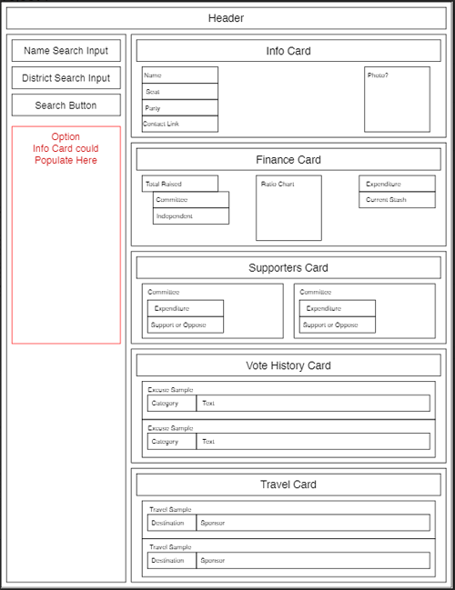

# US Representatives

[US Voter Representatives Landing Page](https://maryvpie.github.io/us-voter-representatives/) - deployed version

## About

 This app helps US voters to be informed about their representatives. By using publicly available civic APIs we created a tool to bring hidden information to curious voters in a non-biased, comprehensible way.


## Screenshots and mockups of the page

||  |
| --- | --- |
|  Work done | Mockup |

---

## What's included

- index.html:
    - optimized for the accessibility needs
    - responsive design for smaller screen sizes

- styles.css
  - optimized styles
  - comments about how they are styling respective elements groups
  
- script.js:
  - primary data collection script
  - working with objects
  - optimized code using functions

- lastsearched.js
  - provide function to store/retrieve last user district search

- stateData.js
  - Object file containing district info for each state

- findmyrep.js
  - provide functions to get user district from address

- info.js
  - loads data on Information Card

- finance.js
  - loads data on Information Card

- supporters.js
  - loads data on Information Card

- travel.js
  - loads data on Information Card

- votehistory.js
  - loads data on Information Card

- Technologies/Frameworks/Resources Used (see dependencies section below):
  - JQuery
  - server-side APIs
  - materializecss
  - google fonts
  

## Dependencies 
**Materialize:** 
Project webpage: https://materializecss.com/ 
To include in project file:
```
    <!-- Compiled and minified CSS -->
    <link rel="stylesheet" href="https://cdnjs.cloudflare.com/ajax/libs/materialize/1.0.0/css/materialize.min.css">

    <!-- Compiled and minified JavaScript -->
    <script src="https://cdnjs.cloudflare.com/ajax/libs/materialize/1.0.0/js/materialize.min.js"></script>
```

**jQuery:** 
Project webpage: https://jquery.com/  
To include in project file:  
```
<script src="https://cdnjs.cloudflare.com/ajax/libs/jquery/3.2.1/jquery.min.js"></script>
```


## How can I contribute or help?
- Star our GitHub repo :star:
- Create pull requests, submit bugs, suggest new features or documentation updates :wrench:


## How to download the sources and contribute on the code
1. use ```git clone ``` to clone repo sources
2. create a branch with the ```git checkout -b <your_branch_name>```
3. push your branch with ```git push -u origin <your_branch_name>``` 
4. create a pull request for our review

## From developers
Made by [:milky_way:Sheri](https://github.com/grudgecat), [Kenny](https://github.com/knyngun), [Sam](https://github.com/syadII), [:camera:William](https://github.com/WilliamCrownover) and [:crab:Mariia](https://github.com/MaryVPie).
We're always happy to receive your feedback!

## More from us
To be updated with new projects.

